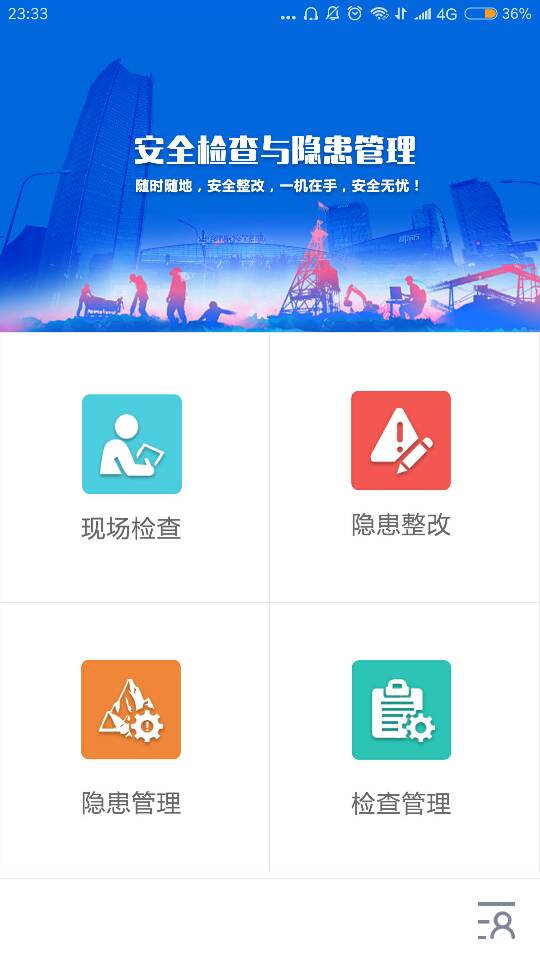

# 矿山安全检查

## 说明
该软件用于山东某矿业公司进行安全检查

## 截图

## 感谢以下开源框架

- [Butterknife](https://github.com/JakeWharton/butterknife/)
- [Rxjava](https://github.com/ReactiveX/RxJava/)
- [RxAndroid](https://github.com/ReactiveX/RxAndroid)
- [greendao](https://github.com/greenrobot/greenDAO)
- [Rxpermissions](https://github.com/tbruyelle/RxPermissions)
- [gson](https://github.com/google/gson)
- [glide](https://github.com/bumptech/glide)
- [album](https://github.com/yanzhenjie/Album/)
- [BaseRecyclerViewAdapterHelper](https://github.com/CymChad/BaseRecyclerViewAdapterHelper/)
- [material-dialogs](https://github.com/afollestad/material-dialogs)
- [material-spinner](https://github.com/jaredrummler/MaterialSpinner)
- [SmartRefreshLayout](https://github.com/scwang90/SmartRefreshLayout/)
- 友盟推送

## 许可证
    Copyright 2018 DavidLyc
    
    Licensed under the Apache License, Version 2.0 (the "License");you may not use this file except in compliance
    with the License.You may obtain a copy of the License at
    
        http://www.apache.org/licenses/LICENSE-2.0
        
    Unless required by applicable law or agreed to in writing, softwaredistributed under the License is distributed
    on an "AS IS" BASIS,WITHOUT WARRANTIES OR CONDITIONS OF ANY KIND, either express or implied.See the License for 
    the specific language governing permissions and limitations under the License.
